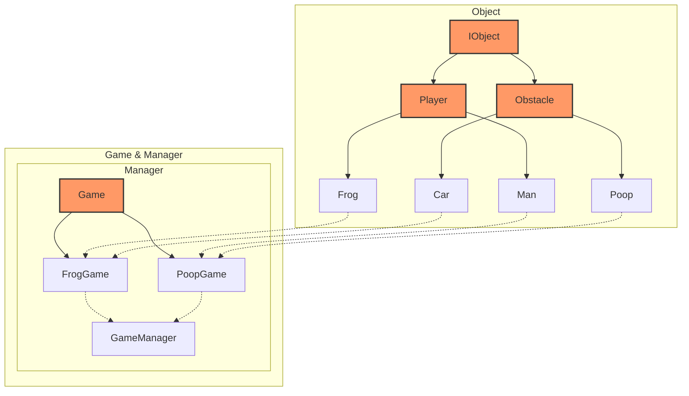

# C++ 게임 프로젝트

개구리 게임과 똥 피하기 게임 두 개를 객체 지항형 프로그래밍 패러다임을 적용하여 만들었다.

객체 지향 패러다임을 잘 지키기 위해 노력했지만, 정작 완성하고 나니 아쉬운 부분이 많이 보인다.

## 계층도

클래스 계층도는 아래와 같다.

## 분석

객체 지향 프로그래밍을 본격적으로 활용해본 것은 처음이라 아무래도 아쉬운 부분이 조금 많았다.

내가 만든 코드를 SOLID 원칙에 입각하여 분석해보자.

### 간단한 정리

SRP 측면에서, 단일 클래스가 다양한 책임을 맡고 있는 경우가 있다.

OCP/DIP 관점에서, GameManager가 FrogGame, PoopGame 등의 구체 인스턴스에 직접 의존한다.

ISP 관점에서, IObject가 무겁게 설계된 점이 걸린다.

LSP는 setDir() 메서드를 제외하면 괜찮게 지켜진 것 같다.

### 상세 내용

#### IObject 및 하위 클래스

1. Single Responsibility Principle (SRP)
    - IObject는 모든 객체의 공통 인터페이스를 정의하고, Player와 Obstacle은 각각 플레이어와 장애물의 속성과 동작을 정의한다.
    - 하나의 클래스 안에서 그리기와 이동 등의 여러 액션을 처리하고 있다. 그리기와 이동, 충돌 판단 등은 전부 Object 객체 내에서 이루어지는 것이 합리적이라고 생각했지만 다시 보니 예상보다 많은 책임을 가지고 있는 것 같다.

2. Open/Closed Principle (OCP)
    - IObject는 인터페이스로, 새로운 객체를 추가할 때 기존 코드를 수정하지 않고도 새로운 클래스를 추가할 수 있다.
    - 다만 Draw 함수 포인터가 도형별 함수 포인터를 저장하고 있는데, 새로운 도형을 추가한다면 함수 포인터 배열을 수정해야 하기 때문에 완전히 OCP를 준수한다고 볼 수는 없다.

3. Liskov Substitution Principle (LSP)
    - Frog 와 Man 클래스의 setDir() 메서드가 서로 다른 동작을 하여 상위 클래스로 일관되게 치환할 수 없다.
    - 이외에는 리스코프 치환 원칙이 지켜진 것으로 보인다.

4. Interface Segregation Principle (ISP)
    - 단순히 '그리기'만 필요한 객체를 만들어도 다른 메서드를 추가로 구현해야 한다.
    - STM32라는 제한을 생각해보면 문제가 발생할 여지는 없지만, 규모가 커진다면 움직일 수 있는 인터페이스, 충돌 인터페이스 등을 나누어 필요한 기능만을 구현해야 할 것 같다.

5. Dependency Inversion Principle (DIP)
    - Car, Frog 등의 구체 클래스에 의존하지 않고 추상화된 IObject에 의존하도록 설계되어 있다.
    - 하지만 그리기 메서드는 함수 포인터 배열을 갖고 있으므로, 새로운 도형 추가 시 배열 수정이 필요하다. 이는 렌더링 방식을 외부에서 주입받게끔 한다면 해결할 수 있을 것으로 보인다.

#### GameManager

1. Single Responsibility Principle (SRP)
    - 하나의 클래스에 지나치게 많은 책임이 부여되어 있다. 게임 선택, 초기화, 타이틀 표시 등의 기능을 모두 포함하고 있다. 선택창과 타이틀을 별도의 클래스로 분리하여 책임을 나누는 것이 좋다고 판단된다.

2. Open/Closed Principle (OCP)
    - 게임 매니저는 새로운 게임을 추가할 때 기존 코드를 수정해야 한다. 게임을 동적으로 관리하거나 팩토리 패턴 등을 적용해볼 수 있을 것 같다.

3. Liskov Substitution Principle (LSP)
    - 추상 클래스를 따로 만들지 않고 게임 관리 객체를 바로 만들었으므로, LSP를 적용할 상위 타입이 존재하지 않는다.

4. Interface Segregation Principle (ISP)
    - 추상 클래스를 따로 만들지 않고 게임 관리 객체를 바로 만들었으므로, ISP를 적용할 상위 타입이 존재하지 않는다.

5. Dependency Inversion Principle (DIP)
    - GameManager는 Game 클래스를 상속받은 구체 클래스에 직접 의존하여 DIP를 위배한다.
    - Game 추상 클래스에 의존하는 식으로 변경하고, 구체 게임 인스턴스는 의존성 주입 컨테이너 등의 방식으로 구성해야 할 것 같다.

#### Game 및 하위 클래스

1. Single Responsibility Principle (SRP)
    - 게임 로직과 충돌 감지, 점수 처리 등의 다양한 책임을 지고 있다. 게임 로직만을 여기서 담당하고 충돌 감지 및 점수 처리는 별도의 클래스로 분리해야 할 것 같다.

2. Open/Closed Principle (OCP)
    - 게임 클래스는 추상 클래스로, 새로운 게임을 추가할 때 기존 코드를 수정하지 않고도 새로운 게임을 추가할 수 있다.
    - 하지만 각 게임에 대한 구체적인 구현은 GameManager와 Game 클래스에 포함되어 있어, 새로운 게임을 추가할 때 기존 코드를 수정해야 한다. 게임 로직을 별도의 클래스로 분리하여 확장성을 높이는 것이 좋을 것으로 판단된다.

3. Liskov Substitution Principle (LSP)
    - 상속받은 메서드들을 적절히 오버라이드하여 사용하고 있다. LSP가 잘 지켜진 것으로 판단된다.

4. Interface Segregation Principle (ISP)
    - IObject와 마찬가지로, Game 클래스가 무겁게 설계되어 있어 구체 클래스에 필요하지 않은 메서드가 포함될 수 있다.

5. Dependency Inversion Principle (DIP)
    - FrogGame과 PoopGame은 IObject 기반 객체들을 직접 생성하여 사용한다.
    - 추상화된 IObject 인터페이스에 의존하긴 하지만, 객체 생성 로직이 각 클래스로 분산되어 있어서 객체 생성 방식을 변경한다면 Game 관련 클래스들의 코드를 수정해야 한다.
